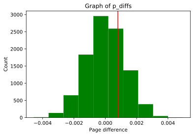

# Project : Analyse AB Test Result
> Authored by: **Abhishek Pandey** [LinkedIn](https://www.linkedin.com/in/abhishekpandeyit/) | [Twitter](https://twitter.com/PandeyJii_)

## Introduction

A/B tests are very commonly performed by data analysts and data scientists. For this project, I am working to analyse the result of A/B test run by an e-commerce website.  In this notebook I am working to help the company understand if they should implement the new page, keep the old page, or perhaps run the experiment longer to make their decision.

> ### Importing Important Libraries to work on the given data Set


```python
import pandas as pd
import numpy as np
import random
import matplotlib.pyplot as plt
%matplotlib inline
random.seed(42)
```


```python
"""Reading the dataset"""

df = pd.read_csv('F:/Github_repo/Analyze_ABTest_result/dataset-ab.csv')
df.head()
```


<div>
<style scoped>
    .dataframe tbody tr th:only-of-type {
        vertical-align: middle;
    }

    .dataframe tbody tr th {
        vertical-align: top;
    }

    .dataframe thead th {
        text-align: right;
    }
</style>
<table border="1" class="dataframe">
  <thead>
    <tr style="text-align: right;">
      <th></th>
      <th>user_id</th>
      <th>timestamp</th>
      <th>group</th>
      <th>landing_page</th>
      <th>converted</th>
    </tr>
  </thead>
  <tbody>
    <tr>
      <th>0</th>
      <td>851104</td>
      <td>2017-01-21 22:11:48.556739</td>
      <td>control</td>
      <td>old_page</td>
      <td>0</td>
    </tr>
    <tr>
      <th>1</th>
      <td>804228</td>
      <td>2017-01-12 08:01:45.159739</td>
      <td>control</td>
      <td>old_page</td>
      <td>0</td>
    </tr>
    <tr>
      <th>2</th>
      <td>661590</td>
      <td>2017-01-11 16:55:06.154213</td>
      <td>treatment</td>
      <td>new_page</td>
      <td>0</td>
    </tr>
    <tr>
      <th>3</th>
      <td>853541</td>
      <td>2017-01-08 18:28:03.143765</td>
      <td>treatment</td>
      <td>new_page</td>
      <td>0</td>
    </tr>
    <tr>
      <th>4</th>
      <td>864975</td>
      <td>2017-01-21 01:52:26.210827</td>
      <td>control</td>
      <td>old_page</td>
      <td>1</td>
    </tr>
  </tbody>
</table>
</div>


### To find the no. of rows in the Data Set using `df.shape[0]` where [0] represents rows


```python
n_rows= df.shape[0]
n_rows
```


    294478


### To find the number of unique users in the data set I am using `nunique()` function of the python and finding unique user with the help of user_id.


```python
unique_users= df.user_id.nunique()
unique_users
```


    290584


### The proportion of converted user:
> As in this data set converted users are marked by [1], so I am using only those rows which is marked as 1 in their "converted" column.
>
> Here I am using `df.query()` function to find the converted users.


```python
proportion= df.query("converted == 1").shape[0]/n_rows
proportion
```


    0.11965919355605512


### The number of times the `new_page` and `treatment` don't line up.


```python
 """
 Number of rows, when group is not treatment but landing page is the new page
 """
grp_npage=df.query('group!="treatment" and landing_page=="new_page"').shape[0]

"""
 Number of rows, when group is not control but landing page is the old page
 """
grp_opage= df.query('group!="control" and landing_page=="old_page"').shape[0]

# summing both the grps

grp_sum=grp_npage+grp_opage
grp_sum

```


    3893


### Checking if any column having missing values.


```python
df.isnull().sum()
```


    user_id         0
    timestamp       0
    group           0
    landing_page    0
    converted       0
    dtype: int64


*** Above result clearly shows that this data set have no missing values***


```python
# Creating a copy of the dataframe
df2=df
```


```python
# dataframe where treatment is not aligned with new_page or control is not aligned with old_page 
df2 = df[((df.group=='treatment') & (df.landing_page=='new_page')) | ((df.group=='control') & (df.landing_page=='old_page'))]
```


```python
# Checking for unique User IDS
df2["user_id"].nunique()
```


    290584


```python
#Finding the duplicate User_ID
df2.user_id[df2.user_id.duplicated()]
```


    2893    773192
    Name: user_id, dtype: int64


```python
df2.loc[df2.user_id.duplicated()]
```


<div>
<style scoped>
    .dataframe tbody tr th:only-of-type {
        vertical-align: middle;
    }

    .dataframe tbody tr th {
        vertical-align: top;
    }

    .dataframe thead th {
        text-align: right;
    }
</style>
<table border="1" class="dataframe">
  <thead>
    <tr style="text-align: right;">
      <th></th>
      <th>user_id</th>
      <th>timestamp</th>
      <th>group</th>
      <th>landing_page</th>
      <th>converted</th>
    </tr>
  </thead>
  <tbody>
    <tr>
      <th>2893</th>
      <td>773192</td>
      <td>2017-01-14 02:55:59.590927</td>
      <td>treatment</td>
      <td>new_page</td>
      <td>0</td>
    </tr>
  </tbody>
</table>
</div>


```python
#Removing
df2 = df2.drop_duplicates()
```


```python
# The probability of an individual converting given that an individual was in the control group
control_group = len(df2.query('group=="control" and converted==1'))/len(df2.query('group=="control"'))
control_group
```


    0.1203863045004612


```python
# The probability of an individual converting given that an individual was in the treatment group
treatment_group = len(df2.query('group=="treatment" and converted==1'))/len(df2.query('group=="treatment"'))
treatment_group
```


    0.11880724790277405


```python
# The probability of individual received new page
len(df2.query('landing_page=="new_page"'))/len(df2.index)
```


    0.5000636646764286


> - Probability of individual converting given individual is in control group = **0.1203863045004612.**
> - Probability of individual converting given individual is in treatment group = **0.11880724790277405.**
>
> This Analysis gives a strong evidence that there isn't any further conversion between new page and old page.
> Since the conversion Probability of both are nearly same, then it is neccessary to analyse other factors too.

### Part II - A/B Test


```python
p_new = len(df2.query( 'converted==1'))/len(df2.index)
p_new
```


    0.11959667567149027


```python
# Conversion rate for p_old under null.
p_old = len(df2.query('converted==1'))/len(df2.index)
p_old
```


    0.11959667567149027


```python
# probablity under null
p=np.mean([p_old,p_new])
p
```


    0.11959667567149027


```python
# difference of p_new and p_old
p_diff=p_new-p_old
```


```python
#calculating the value of n_new
n_new = len(df2.query('landing_page=="new_page"'))
n_new
```


    145311


```python
#calculating the value of n_old
n_old = len(df2.query('landing_page=="old_page"'))
n_old
```


    145274


```python
## simulate n_old transactions with a convert rate of p_new under the null
new_page_converted = np.random.choice([0, 1], n_new, p = [p_new, 1-p_new])
```


```python
# simulate n_old transactions with a convert rate of p_old under the null
old_page_converted = np.random.choice([0, 1], n_old, p = [p_old, 1-p_old])
```


```python
# differences computed in from p_new and p_old
obs_diff= new_page_converted.mean() - old_page_converted.mean()# differences computed in from p_new and p_old
obs_diff
```


    0.0008014194200020031


```python
# Create sampling distribution for difference in p_new-p_old simulated values
# with boostrapping
p_diffs = []
for i in range(10000):
    
    # 1st parameter dictates the choices you want.  In this case [1, 0]
    p_new1 = np.random.choice([1, 0],n_new,replace = True,p = [p_new, 1-p_new])
    p_old1 = np.random.choice([1, 0],n_old,replace = True,p = [p_old, 1-p_old])
    p_new2 = p_new1.mean()
    p_old2 = p_old1.mean()
    p_diffs.append(p_new2-p_old2)
#_p_diffs = np.array(_p_diffs)
```


```python
p_diffs=np.array(p_diffs)
#histogram of p_diff
plt.hist(p_diffs, color='purple')
plt.title('Graph of p_diffs')#title of graphs
plt.xlabel('Page difference') # x-label of graphs
plt.ylabel('Count'); # y-label of graphs
```


```python
#histogram of p_diff
plt.hist(p_diffs, color='green');

plt.title('Graph of p_diffs') #title of graphs
plt.xlabel('Page difference') # x-label of graphs
plt.ylabel('Count') # y-label of graphs

plt.axvline(x= obs_diff, color='r');
```





### What proportion of the **p_diffs** are greater than the actual difference observed in **dataset-ab.csv**?


```python
var1 = df2[df2['landing_page'] == 'new_page']
var1=var1['converted'].mean()
var2 = df2[df2['landing_page'] == 'old_page']
var2 = var2['converted'].mean()
actual_diff = var1-var2
count = 0
for i in p_diffs:
    if i> actual_diff:
        count = count+1
        
print (count/(len(p_diffs)))
```

    0.903
    

> Above calculation of p-value is almost ***90%*** of the population is above the real diffrence which suggested that, the new-page is not doing significantly better than the old page. Therefore we should stick to the null hyposthesis as p-value is very large.


```python
import statsmodels.api as sm

convert_old = len(df2.query('converted==1 and landing_page=="old_page"')) #rows converted with old_page
convert_new = len(df2.query('converted==1 and landing_page=="new_page"')) #rows converted with new_page
n_old = len(df2.query('landing_page=="old_page"')) #rows_associated with old_page
n_new = len(df2.query('landing_page=="new_page"')) #rows associated with new_page
n_new
```


    145311


```python
#Computing z_score and p_value
z_score, p_value = sm.stats.proportions_ztest([convert_old,convert_new], [n_old, n_new],alternative='smaller') 

#display z_score and p_value
print(z_score,p_value)
```

    1.3116075339133115 0.905173705140591
    


```python
from scipy.stats import norm
norm.cdf(z_score) #how significant our z_score is
```


    0.905173705140591


```python
norm.ppf(1-(0.05)) #critical value of 95% confidence
```


    1.6448536269514722


## Working on Logistic Regression


```python
#adding an intercept column
df2['intercept'] = 1

#Create dummy variable column
df2['ab_page'] = pd.get_dummies(df2['group'])['treatment']

df2.head()
```


<div>
<style scoped>
    .dataframe tbody tr th:only-of-type {
        vertical-align: middle;
    }

    .dataframe tbody tr th {
        vertical-align: top;
    }

    .dataframe thead th {
        text-align: right;
    }
</style>
<table border="1" class="dataframe">
  <thead>
    <tr style="text-align: right;">
      <th></th>
      <th>user_id</th>
      <th>timestamp</th>
      <th>group</th>
      <th>landing_page</th>
      <th>converted</th>
      <th>intercept</th>
      <th>ab_page</th>
    </tr>
  </thead>
  <tbody>
    <tr>
      <th>0</th>
      <td>851104</td>
      <td>2017-01-21 22:11:48.556739</td>
      <td>control</td>
      <td>old_page</td>
      <td>0</td>
      <td>1</td>
      <td>0</td>
    </tr>
    <tr>
      <th>1</th>
      <td>804228</td>
      <td>2017-01-12 08:01:45.159739</td>
      <td>control</td>
      <td>old_page</td>
      <td>0</td>
      <td>1</td>
      <td>0</td>
    </tr>
    <tr>
      <th>2</th>
      <td>661590</td>
      <td>2017-01-11 16:55:06.154213</td>
      <td>treatment</td>
      <td>new_page</td>
      <td>0</td>
      <td>1</td>
      <td>1</td>
    </tr>
    <tr>
      <th>3</th>
      <td>853541</td>
      <td>2017-01-08 18:28:03.143765</td>
      <td>treatment</td>
      <td>new_page</td>
      <td>0</td>
      <td>1</td>
      <td>1</td>
    </tr>
    <tr>
      <th>4</th>
      <td>864975</td>
      <td>2017-01-21 01:52:26.210827</td>
      <td>control</td>
      <td>old_page</td>
      <td>1</td>
      <td>1</td>
      <td>0</td>
    </tr>
  </tbody>
</table>
</div>


```python
import statsmodels.api as sm
model=sm.Logit(df2['converted'],df2[['intercept','ab_page']])
results=model.fit() 
```

    Optimization terminated successfully.
             Current function value: 0.366118
             Iterations 6
    


```python
results.summary()
```


<table class="simpletable">
<caption>Logit Regression Results</caption>
<tr>
  <th>Dep. Variable:</th>       <td>converted</td>    <th>  No. Observations:  </th>   <td>290585</td>   
</tr>
<tr>
  <th>Model:</th>                 <td>Logit</td>      <th>  Df Residuals:      </th>   <td>290583</td>   
</tr>
<tr>
  <th>Method:</th>                 <td>MLE</td>       <th>  Df Model:          </th>   <td>     1</td>   
</tr>
<tr>
  <th>Date:</th>            <td>Fri, 19 Jun 2020</td> <th>  Pseudo R-squ.:     </th>  <td>8.085e-06</td> 
</tr>
<tr>
  <th>Time:</th>                <td>11:45:44</td>     <th>  Log-Likelihood:    </th> <td>-1.0639e+05</td>
</tr>
<tr>
  <th>converged:</th>             <td>True</td>       <th>  LL-Null:           </th> <td>-1.0639e+05</td>
</tr>
<tr>
  <th>Covariance Type:</th>     <td>nonrobust</td>    <th>  LLR p-value:       </th>   <td>0.1897</td>   
</tr>
</table>
<table class="simpletable">
<tr>
      <td></td>         <th>coef</th>     <th>std err</th>      <th>z</th>      <th>P>|z|</th>  <th>[0.025</th>    <th>0.975]</th>  
</tr>
<tr>
  <th>intercept</th> <td>   -1.9888</td> <td>    0.008</td> <td> -246.669</td> <td> 0.000</td> <td>   -2.005</td> <td>   -1.973</td>
</tr>
<tr>
  <th>ab_page</th>   <td>   -0.0150</td> <td>    0.011</td> <td>   -1.312</td> <td> 0.190</td> <td>   -0.037</td> <td>    0.007</td>
</tr>
</table>


```python
# Reading the dataset-countries
countries = pd.read_csv('dataset-countries.csv')
countries.head()
```


<div>
<style scoped>
    .dataframe tbody tr th:only-of-type {
        vertical-align: middle;
    }

    .dataframe tbody tr th {
        vertical-align: top;
    }

    .dataframe thead th {
        text-align: right;
    }
</style>
<table border="1" class="dataframe">
  <thead>
    <tr style="text-align: right;">
      <th></th>
      <th>user_id</th>
      <th>country</th>
    </tr>
  </thead>
  <tbody>
    <tr>
      <th>0</th>
      <td>834778</td>
      <td>UK</td>
    </tr>
    <tr>
      <th>1</th>
      <td>928468</td>
      <td>US</td>
    </tr>
    <tr>
      <th>2</th>
      <td>822059</td>
      <td>UK</td>
    </tr>
    <tr>
      <th>3</th>
      <td>711597</td>
      <td>UK</td>
    </tr>
    <tr>
      <th>4</th>
      <td>710616</td>
      <td>UK</td>
    </tr>
  </tbody>
</table>
</div>


```python
#Using inner join to join two dates
new = countries.set_index('user_id').join(df2.set_index('user_id'), how = 'inner')
new.head()
```


<div>
<style scoped>
    .dataframe tbody tr th:only-of-type {
        vertical-align: middle;
    }

    .dataframe tbody tr th {
        vertical-align: top;
    }

    .dataframe thead th {
        text-align: right;
    }
</style>
<table border="1" class="dataframe">
  <thead>
    <tr style="text-align: right;">
      <th></th>
      <th>country</th>
      <th>timestamp</th>
      <th>group</th>
      <th>landing_page</th>
      <th>converted</th>
      <th>intercept</th>
      <th>ab_page</th>
    </tr>
    <tr>
      <th>user_id</th>
      <th></th>
      <th></th>
      <th></th>
      <th></th>
      <th></th>
      <th></th>
      <th></th>
    </tr>
  </thead>
  <tbody>
    <tr>
      <th>630000</th>
      <td>US</td>
      <td>2017-01-19 06:26:06.548941</td>
      <td>treatment</td>
      <td>new_page</td>
      <td>0</td>
      <td>1</td>
      <td>1</td>
    </tr>
    <tr>
      <th>630001</th>
      <td>US</td>
      <td>2017-01-16 03:16:42.560309</td>
      <td>treatment</td>
      <td>new_page</td>
      <td>1</td>
      <td>1</td>
      <td>1</td>
    </tr>
    <tr>
      <th>630002</th>
      <td>US</td>
      <td>2017-01-19 19:20:56.438330</td>
      <td>control</td>
      <td>old_page</td>
      <td>0</td>
      <td>1</td>
      <td>0</td>
    </tr>
    <tr>
      <th>630003</th>
      <td>US</td>
      <td>2017-01-12 10:09:31.510471</td>
      <td>treatment</td>
      <td>new_page</td>
      <td>0</td>
      <td>1</td>
      <td>1</td>
    </tr>
    <tr>
      <th>630004</th>
      <td>US</td>
      <td>2017-01-18 20:23:58.824994</td>
      <td>treatment</td>
      <td>new_page</td>
      <td>0</td>
      <td>1</td>
      <td>1</td>
    </tr>
  </tbody>
</table>
</div>


```python
#adding dummy variables with 'CA' as the baseline
new[['US', 'UK']] = pd.get_dummies(new['country'])[['US', "UK"]]
new.head()
```


<div>
<style scoped>
    .dataframe tbody tr th:only-of-type {
        vertical-align: middle;
    }

    .dataframe tbody tr th {
        vertical-align: top;
    }

    .dataframe thead th {
        text-align: right;
    }
</style>
<table border="1" class="dataframe">
  <thead>
    <tr style="text-align: right;">
      <th></th>
      <th>country</th>
      <th>timestamp</th>
      <th>group</th>
      <th>landing_page</th>
      <th>converted</th>
      <th>intercept</th>
      <th>ab_page</th>
      <th>US</th>
      <th>UK</th>
    </tr>
    <tr>
      <th>user_id</th>
      <th></th>
      <th></th>
      <th></th>
      <th></th>
      <th></th>
      <th></th>
      <th></th>
      <th></th>
      <th></th>
    </tr>
  </thead>
  <tbody>
    <tr>
      <th>630000</th>
      <td>US</td>
      <td>2017-01-19 06:26:06.548941</td>
      <td>treatment</td>
      <td>new_page</td>
      <td>0</td>
      <td>1</td>
      <td>1</td>
      <td>1</td>
      <td>0</td>
    </tr>
    <tr>
      <th>630001</th>
      <td>US</td>
      <td>2017-01-16 03:16:42.560309</td>
      <td>treatment</td>
      <td>new_page</td>
      <td>1</td>
      <td>1</td>
      <td>1</td>
      <td>1</td>
      <td>0</td>
    </tr>
    <tr>
      <th>630002</th>
      <td>US</td>
      <td>2017-01-19 19:20:56.438330</td>
      <td>control</td>
      <td>old_page</td>
      <td>0</td>
      <td>1</td>
      <td>0</td>
      <td>1</td>
      <td>0</td>
    </tr>
    <tr>
      <th>630003</th>
      <td>US</td>
      <td>2017-01-12 10:09:31.510471</td>
      <td>treatment</td>
      <td>new_page</td>
      <td>0</td>
      <td>1</td>
      <td>1</td>
      <td>1</td>
      <td>0</td>
    </tr>
    <tr>
      <th>630004</th>
      <td>US</td>
      <td>2017-01-18 20:23:58.824994</td>
      <td>treatment</td>
      <td>new_page</td>
      <td>0</td>
      <td>1</td>
      <td>1</td>
      <td>1</td>
      <td>0</td>
    </tr>
  </tbody>
</table>
</div>


```python
new['US_ab_page'] = new['US']*new['ab_page']
new.head()
```


<div>
<style scoped>
    .dataframe tbody tr th:only-of-type {
        vertical-align: middle;
    }

    .dataframe tbody tr th {
        vertical-align: top;
    }

    .dataframe thead th {
        text-align: right;
    }
</style>
<table border="1" class="dataframe">
  <thead>
    <tr style="text-align: right;">
      <th></th>
      <th>country</th>
      <th>timestamp</th>
      <th>group</th>
      <th>landing_page</th>
      <th>converted</th>
      <th>intercept</th>
      <th>ab_page</th>
      <th>US</th>
      <th>UK</th>
      <th>US_ab_page</th>
    </tr>
    <tr>
      <th>user_id</th>
      <th></th>
      <th></th>
      <th></th>
      <th></th>
      <th></th>
      <th></th>
      <th></th>
      <th></th>
      <th></th>
      <th></th>
    </tr>
  </thead>
  <tbody>
    <tr>
      <th>630000</th>
      <td>US</td>
      <td>2017-01-19 06:26:06.548941</td>
      <td>treatment</td>
      <td>new_page</td>
      <td>0</td>
      <td>1</td>
      <td>1</td>
      <td>1</td>
      <td>0</td>
      <td>1</td>
    </tr>
    <tr>
      <th>630001</th>
      <td>US</td>
      <td>2017-01-16 03:16:42.560309</td>
      <td>treatment</td>
      <td>new_page</td>
      <td>1</td>
      <td>1</td>
      <td>1</td>
      <td>1</td>
      <td>0</td>
      <td>1</td>
    </tr>
    <tr>
      <th>630002</th>
      <td>US</td>
      <td>2017-01-19 19:20:56.438330</td>
      <td>control</td>
      <td>old_page</td>
      <td>0</td>
      <td>1</td>
      <td>0</td>
      <td>1</td>
      <td>0</td>
      <td>0</td>
    </tr>
    <tr>
      <th>630003</th>
      <td>US</td>
      <td>2017-01-12 10:09:31.510471</td>
      <td>treatment</td>
      <td>new_page</td>
      <td>0</td>
      <td>1</td>
      <td>1</td>
      <td>1</td>
      <td>0</td>
      <td>1</td>
    </tr>
    <tr>
      <th>630004</th>
      <td>US</td>
      <td>2017-01-18 20:23:58.824994</td>
      <td>treatment</td>
      <td>new_page</td>
      <td>0</td>
      <td>1</td>
      <td>1</td>
      <td>1</td>
      <td>0</td>
      <td>1</td>
    </tr>
  </tbody>
</table>
</div>


```python
new['UK_ab_page'] = new['UK']*new['ab_page']
new.head()
```


<div>
<style scoped>
    .dataframe tbody tr th:only-of-type {
        vertical-align: middle;
    }

    .dataframe tbody tr th {
        vertical-align: top;
    }

    .dataframe thead th {
        text-align: right;
    }
</style>
<table border="1" class="dataframe">
  <thead>
    <tr style="text-align: right;">
      <th></th>
      <th>country</th>
      <th>timestamp</th>
      <th>group</th>
      <th>landing_page</th>
      <th>converted</th>
      <th>intercept</th>
      <th>ab_page</th>
      <th>US</th>
      <th>UK</th>
      <th>US_ab_page</th>
      <th>UK_ab_page</th>
    </tr>
    <tr>
      <th>user_id</th>
      <th></th>
      <th></th>
      <th></th>
      <th></th>
      <th></th>
      <th></th>
      <th></th>
      <th></th>
      <th></th>
      <th></th>
      <th></th>
    </tr>
  </thead>
  <tbody>
    <tr>
      <th>630000</th>
      <td>US</td>
      <td>2017-01-19 06:26:06.548941</td>
      <td>treatment</td>
      <td>new_page</td>
      <td>0</td>
      <td>1</td>
      <td>1</td>
      <td>1</td>
      <td>0</td>
      <td>1</td>
      <td>0</td>
    </tr>
    <tr>
      <th>630001</th>
      <td>US</td>
      <td>2017-01-16 03:16:42.560309</td>
      <td>treatment</td>
      <td>new_page</td>
      <td>1</td>
      <td>1</td>
      <td>1</td>
      <td>1</td>
      <td>0</td>
      <td>1</td>
      <td>0</td>
    </tr>
    <tr>
      <th>630002</th>
      <td>US</td>
      <td>2017-01-19 19:20:56.438330</td>
      <td>control</td>
      <td>old_page</td>
      <td>0</td>
      <td>1</td>
      <td>0</td>
      <td>1</td>
      <td>0</td>
      <td>0</td>
      <td>0</td>
    </tr>
    <tr>
      <th>630003</th>
      <td>US</td>
      <td>2017-01-12 10:09:31.510471</td>
      <td>treatment</td>
      <td>new_page</td>
      <td>0</td>
      <td>1</td>
      <td>1</td>
      <td>1</td>
      <td>0</td>
      <td>1</td>
      <td>0</td>
    </tr>
    <tr>
      <th>630004</th>
      <td>US</td>
      <td>2017-01-18 20:23:58.824994</td>
      <td>treatment</td>
      <td>new_page</td>
      <td>0</td>
      <td>1</td>
      <td>1</td>
      <td>1</td>
      <td>0</td>
      <td>1</td>
      <td>0</td>
    </tr>
  </tbody>
</table>
</div>


```python
logit3 = sm.Logit(new['converted'], new[['intercept', 'ab_page', 'US', 'UK', 'US_ab_page', 'US_ab_page']])
logit3
```


    <statsmodels.discrete.discrete_model.Logit at 0x202a47dec88>


```python
#Check the result
result3 = logit3.fit()
```

    Optimization terminated successfully.
             Current function value: 0.366111
             Iterations 6
    


```python
result3.summary()
```


<table class="simpletable">
<caption>Logit Regression Results</caption>
<tr>
  <th>Dep. Variable:</th>       <td>converted</td>    <th>  No. Observations:  </th>   <td>290585</td>   
</tr>
<tr>
  <th>Model:</th>                 <td>Logit</td>      <th>  Df Residuals:      </th>   <td>290580</td>   
</tr>
<tr>
  <th>Method:</th>                 <td>MLE</td>       <th>  Df Model:          </th>   <td>     4</td>   
</tr>
<tr>
  <th>Date:</th>            <td>Fri, 19 Jun 2020</td> <th>  Pseudo R-squ.:     </th>  <td>2.590e-05</td> 
</tr>
<tr>
  <th>Time:</th>                <td>11:45:49</td>     <th>  Log-Likelihood:    </th> <td>-1.0639e+05</td>
</tr>
<tr>
  <th>converged:</th>             <td>True</td>       <th>  LL-Null:           </th> <td>-1.0639e+05</td>
</tr>
<tr>
  <th>Covariance Type:</th>     <td>nonrobust</td>    <th>  LLR p-value:       </th>   <td>0.2388</td>   
</tr>
</table>
<table class="simpletable">
<tr>
       <td></td>         <th>coef</th>     <th>std err</th>      <th>z</th>      <th>P>|z|</th>  <th>[0.025</th>    <th>0.975]</th>  
</tr>
<tr>
  <th>intercept</th>  <td>   -2.0366</td> <td>    0.028</td> <td>  -72.618</td> <td> 0.000</td> <td>   -2.092</td> <td>   -1.982</td>
</tr>
<tr>
  <th>ab_page</th>    <td>   -0.0018</td> <td>    0.021</td> <td>   -0.086</td> <td> 0.931</td> <td>   -0.043</td> <td>    0.039</td>
</tr>
<tr>
  <th>US</th>         <td>    0.0501</td> <td>    0.030</td> <td>    1.691</td> <td> 0.091</td> <td>   -0.008</td> <td>    0.108</td>
</tr>
<tr>
  <th>UK</th>         <td>    0.0507</td> <td>    0.028</td> <td>    1.786</td> <td> 0.074</td> <td>   -0.005</td> <td>    0.106</td>
</tr>
<tr>
  <th>US_ab_page</th> <td>   -0.0094</td> <td> 2.37e+06</td> <td>-3.96e-09</td> <td> 1.000</td> <td>-4.64e+06</td> <td> 4.64e+06</td>
</tr>
<tr>
  <th>US_ab_page</th> <td>   -0.0094</td> <td> 2.37e+06</td> <td>-3.96e-09</td> <td> 1.000</td> <td>-4.64e+06</td> <td> 4.64e+06</td>
</tr>
</table>


**Final Analysis** 
> - None of the variables have significant p-values thus we're unable to counter the null values.
> - There isn't sufficient evidence to suggest that there is an interaction between country and page received, so we can't predict that whether a user converts or not.
> - There isn't any strong evidence that the new page results in more conversions in comparision with the old page.


```python

```
